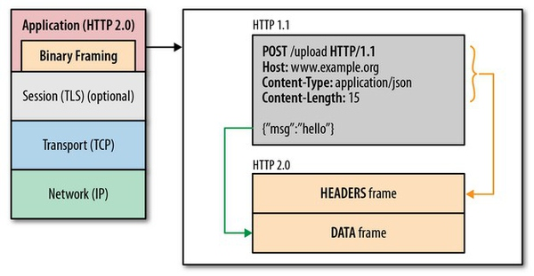

# http协议
HTTP 是基于 TCP/IP 协议的应用层协议。它不涉及数据包（packet）传输，主要规定了客户端和服务器之间的通信格式，默认使用80端口。
## http协议发展史
### 一、HTTP/0.9
最早版本是1991年发布的0.9版。该版本极其简单，只有一个命令GET。
### 二、HTTP/1.0
1996年5月，HTTP/1.0 版本发布  

    缺点：
    每个tcp连接只能发送一个请求，发送数据完毕，连接就关闭（3次握手，4次分手，TCP慢启动）
    TCP慢启动：TCP 连接会随着时间进行自我「调谐」，起初会限制连接的最大速度，如果数据成功传输，会随着时间的推移提高传输的速度。这种调谐则被称为 TCP 
    慢启动。由于这种原因，让原本就具有突发性和短时性的 HTTP 连接变的十分低效。
    https://www.cdnplanet.com/blog/tune-tcp-initcwnd-for-optimum-performance/
    解决办法：Connection: keep-alive（非标准字段，这个字段要求服务器不要关闭TCP连接，以便其他请求复用）

### 三、HTTP/1.1
1997年1月，HTTP/1.1 版本发布，只比 1.0 版本晚了半年，它进一步完善了 HTTP 协议，一直用到了20年后的今天，直到现在还是最流行的版本。

3.1 持久连接

    1.1版的最大变化，就是引入了持久连接（persistent connection），即TCP连接默认不关闭，可以被多个请求复用，不用声明Connection: keep-alive。

3.2 管道机制

    1.1版还引入了管道机制（pipelining），即在同一个TCP连接里面，客户端可以同时发送多个请求。这样就进一步改进了HTTP协议的效率。
    

  

3.3 Content-Length 字段

    一个TCP连接现在可以传送多个回应，势必就要有一种机制，区分数据包是属于哪一个回应的。这就是Content-length字段的作用，声明本次回应的数据长度。
    Content-Length: 3495
    上面代码告诉浏览器，本次回应的长度是3495个字节，后面的字节就属于下一个回应了。
    在1.0版中，Content-Length字段不是必需的，因为浏览器发现服务器关闭了TCP连接，就表明收到的数据包已经全了。

3.4 分块传输编码

    对于一些很耗时的动态操作来说，这意味着，服务器要等到所有操作完成，才能发送数据，显然这样的效率不高。更好的处理方法是，产生一块数据，就发送一块，采用”流模式”（stream）取代”缓存模式”（buffer）。
    因此，1.1版规定可以不使用Content-Length字段，而使用“分块传输编码”（chunked transfer encoding）。只要请求或回应的头信息有Transfer-Encoding字段，就表明回应将由数量未定的数据块组成。
    Transfer-Encoding: chunked
    每个非空的数据块之前，会有一个16进制的数值，表示这个块的长度。最后是一个大小为0的块，就表示本次回应的数据发送完了。下面是一个例子。

3.5 其他功能

    1.1版还新增了许多动词方法：PUT、PATCH、HEAD、 OPTIONS、DELETE。
    另外，客户端请求的头信息新增了Host字段，用来指定服务器的域名。

缺点：

    虽然1.1版允许复用TCP连接，但是同一个TCP连接里面，所有的数据通信是按次序进行的。服务器只有处理完一个回应，才会进行下一个回应。要是前面的回应特别慢，后面就会有许多请求排队等着。这称为“队头堵塞”（Head-of-line blocking）。为了避免这个问题，只有两种方法：一是减少请求数，二是同时多开持久连接。

优化办法，减少请求数，同时多开持久连接：

    Spriting（图片合并）
    Inlining（内容内嵌）
    Concatenation（文件合并）
    Domain Sharding（域名分片）

虽然能起到一定效果，缺陷也明显，比如chrome支持6个连接
    
    每个连接都占用资源消耗
    都要经历3次握手，4次分手
    都要经历慢启动
    域名分片：DNS查询的延迟（移动端不建议使用该优化：http://dev.mobify.com/blog/domain-sharding-bad-news-mobile-performance/）

### 四、SPDY 协议(非标准协议)

    2009年，谷歌公开了自行研发的 SPDY 协议，主要解决 HTTP/1.1 效率不高的问题。
    这个协议在Chrome浏览器上证明可行以后，就被当作 HTTP/2 的基础，主要特性都在 HTTP/2 之中得到继承。
    2015年9月，Google 宣布了计划，移除对SPDY的支持，拥抱 HTTP/2，[18]，并将在Chrome 51中生效。[19][20]

### 五、HTTP/2
2015年，HTTP/2 发布。它不叫 HTTP/2.0，是因为标准委员会不打算再发布子版本了，下一个新版本将是 HTTP/3。

5.1 二进制分帧

    HTTP/1.1 版的头信息肯定是文本（ASCII编码），数据体可以是文本，也可以是二进制。HTTP/2 则是一个彻底的二进制协议，头信息和数据体都是二进制，并且统称为”帧”（frame）：头信息帧和数据帧。
    二进制协议的一个好处是，可以定义额外的帧。HTTP/2 定义了近十种帧，为将来的高级应用打好了基础。如果使用文本实现这种功能，解析数据将会变得非常麻烦，二进制解析则方便得多。

  

    http2.0的格式定义更接近tcp层的方式，这张二机制的方式十分高效且精简。length定义了整个frame的开始到结束，type定义frame的类型（一共10种），flags用bit位定义一些重要的参数，stream id用作流控制，剩下的payload就是request的正文了。

5.2 多工

    HTTP/2 复用TCP连接，在一个连接里，客户端和浏览器都可以同时发送多个请求或回应，而且不用按照顺序一一对应，这样就避免了”队头堵塞”。
    举例来说，在一个TCP连接里面，服务器同时收到了A请求和B请求，于是先回应A请求，结果发现处理过程非常耗时，于是就发送A请求已经处理好的部分， 接着回应B请求，完成后，再发送A请求剩下的部分。
    这样双向的、实时的通信，就叫做多工（Multiplexing）。
    ～5%-15%++

  

5.3 数据流

    因为 HTTP/2 的数据包是不按顺序发送的，同一个连接里面连续的数据包，可能属于不同的回应。因此，必须要对数据包做标记，指出它属于哪个回应。
    HTTP/2 将每个请求或回应的所有数据包，称为一个数据流（stream）。每个数据流都有一个独一无二的编号。数据包发送的时候，都必须标记数据流ID，用来区分它属于哪个数据流。另外还规定，客户端发出的数据流，ID一律为奇数，服务器发出的，ID为偶数。
    数据流发送到一半的时候，客户端和服务器都可以发送信号（RST_STREAM帧），取消这个数据流。1.1版取消数据流的唯一方法，就是关闭TCP连接。这就是说，HTTP/2 可以取消某一次请求，同时保证TCP连接还打开着，可以被其他请求使用。
    
    客户端还可以指定数据流的优先级。优先级越高，服务器就会越早回应。
    假想用户在用你的app浏览商品的时候，快速的滑动到了商品列表的底部，但前面的请求先发出，如果不把后面的请求优先级设高，用户当前浏览的图片要到最后才能下载完成，显然体验没有设置优先级好。同理依赖在有些场景下也有妙用。

    重置连接表现更好很多app客户端都有取消图片下载的功能场景，对于http1.x来说，是通过设置tcp segment里的reset flag来通知对端关闭连接的。这种方式会直接断开连接，下次再发请求就必须重新建立连接。http2.0引入RST_STREAM类型的frame，可以在不断开连接的前提下取消某个request的stream，表现更好。

5.4 头信息压缩

    HTTP 协议不带有状态，每次请求都必须附上所有信息。所以，请求的很多字段都是重复的，比如Cookie和User Agent，一模一样的内容，每次请求都必须附带，这会浪费很多带宽，也影响速度。
    HTTP/2 对这一点做了优化，引入了头信息压缩机制（header compression）。一方面，头信息使用gzip或compress压缩后再发送；另一方面，客户端和服务器同时维护一张头信息表，所有字段都会存入这个表，生成一个索引号，以后就不发送同样字段了，只发送索引号，这样就提高速度了。

    这里普及一个小知识点。现在大家都知道tcp有slow start的特性，三次握手之后开始发送tcp segment，第一次能发送的没有被ack的segment数量是由initial tcp window大小决定的。这个initial tcp window根据平台的实现会有差异，但一般是2个segment或者是4k的大小（一个segment大概是1500个字节），也就是说当你发送的包大小超过这个值的时候，要等前面的包被ack之后才能发送后续的包，显然这种情况下延迟更高。intial window也并不是越大越好，太大会导致网络节点的阻塞，丢包率就会增加，具体细节可以参考IETF这篇文章。http的header现在膨胀到有可能会超过这个intial window的值了，所以更显得压缩header的重要性。

5.5 服务器推送

    HTTP/2 允许服务器未经请求，主动向客户端发送资源，这叫做服务器推送（server push）。
    常见场景是客户端请求一个网页，这个网页里面包含很多静态资源。正常情况下，客户端必须收到网页后，解析HTML源码，发现有静态资源，再发出静态资源请求。其实，服务器可以预期到客户端请求网页后，很可能会再请求静态资源，所以就主动把这些静态资源随着网页一起发给客户端了。
    问题：如果客户端早已在缓存中有了一份 copy 怎么办？

其他未来优化技术(chrome://flags/)：

1. TCP Fast Open

    允许应用在 TCP 握手期间（SYN 和 SYN+ACK packets）交换数据，这样可以减少一次 RTT，不幸的是目前只支持 Linux 以及 OSX，未来 TFO 在 HTTP上将会有更多巧妙的运用。

2. TLS

    在传输应用数据之前，客户端必须与服务端协商密钥、加密算法等信息，服务端还要把自己的证书发给客户端表明其身份，这些环节构成 TLS 握手过程，还没把客户端和服务端处理时间算进去。光是 TLS 握手就需要消耗两个 RTT（Round-Trip Time，往返时间）
    Session Tickets 可以将 TLS 握手所需 RTT 减少到 1 个
    不久的未来,TLS 1.3 将会支持 Zero Round Trip 握手，HTTP 可以在第一个 Round Trip 就发送数据。

5.5 各个软件支持情况

    nginx支持http2，但不支持服务器推送
    jetty9.3.0完全支持http2
    tomcat8.5支持，tomcat9完全支持http2
    考虑到 Servlet 4.0计划支持http2，而http2需要ALPN协议，所以jdk9计划将ALPN纳入

5.5 目前主流浏览器对 HTTP/2 的支持程度  

工具：

    nghttp -nv 'https://local.topchitu.com/test/index.html'

参考文档：
* http://www.ruanyifeng.com/blog/2016/08/http.html
* http://httpwg.org/specs/rfc7540.html
* https://http2.github.io/http2-spec
* https://www.zhihu.com/question/34074946
* https://www.zhihu.com/question/24774343/answer/96586977

